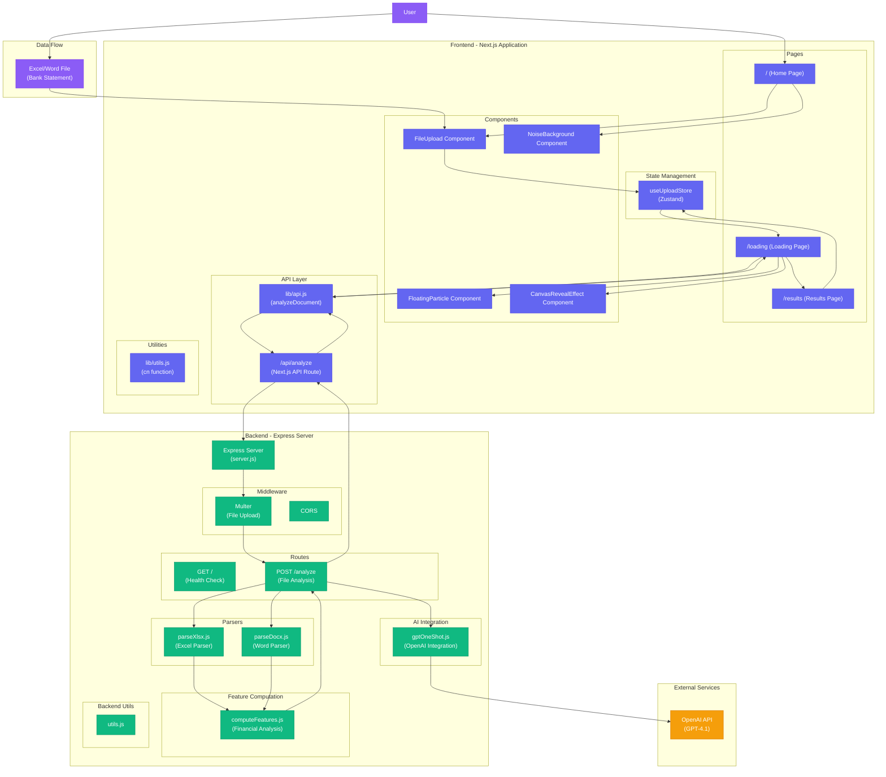
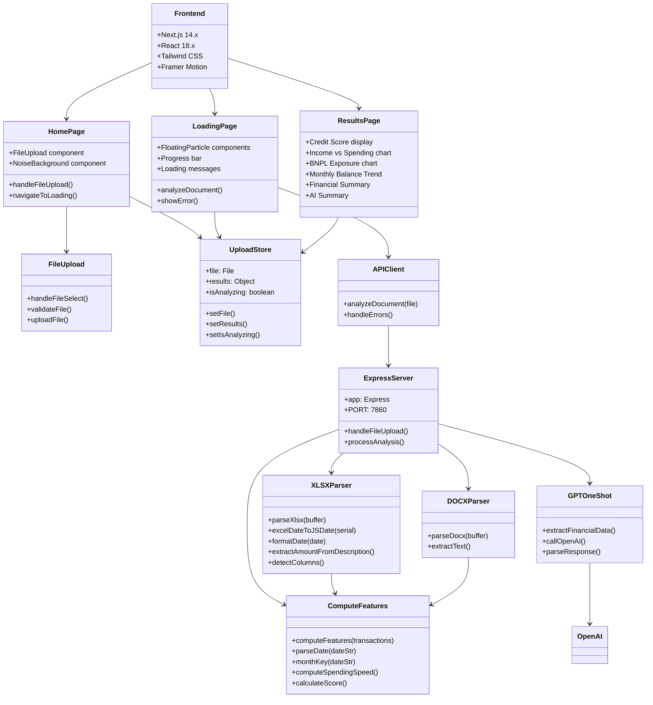
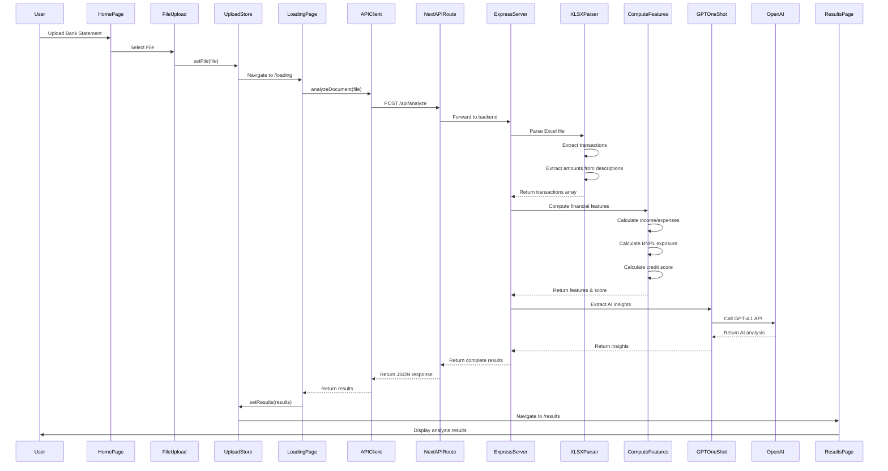
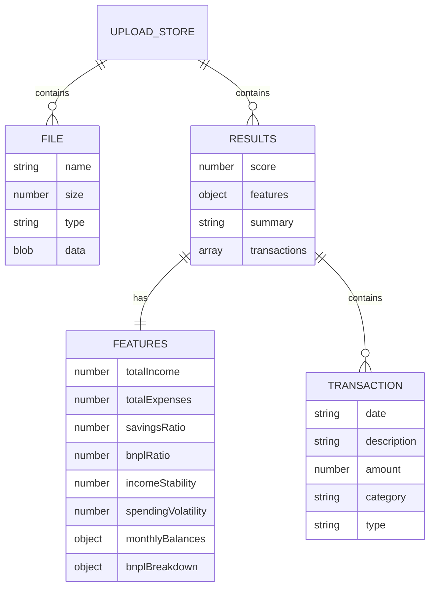
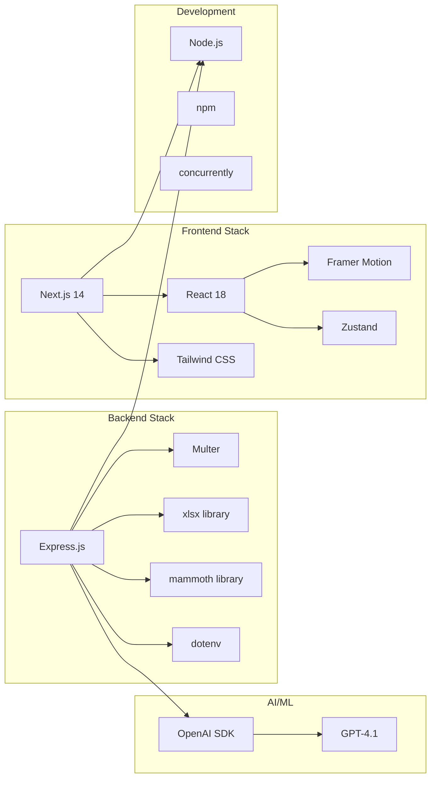
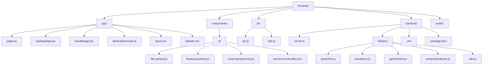

# Financial Analyzer Application - UML Diagram

## System Architecture Diagram

## Component Class Diagram

## Data Flow Sequence Diagram

## Database/State Structure

## Technology Stack Diagram

## File Structure Tree

